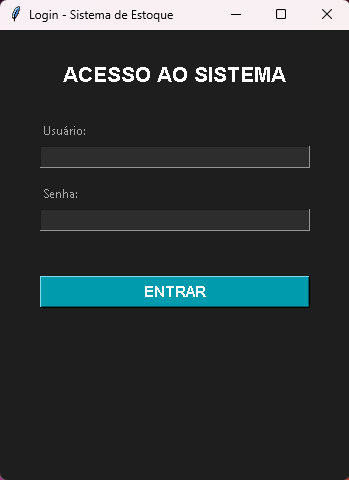
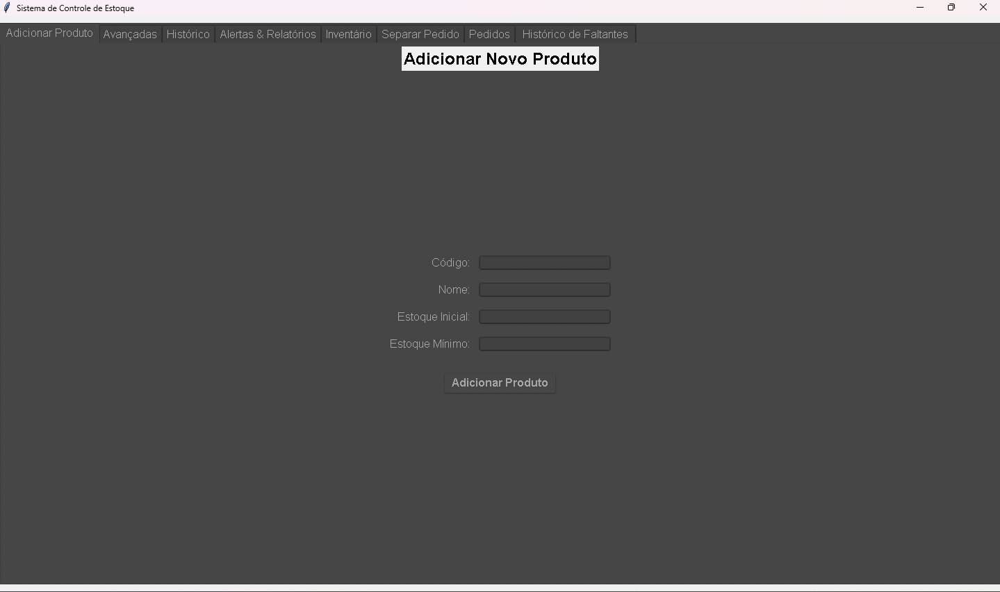

# 📦 Sistema de Estoque

<p align="center">
  Sistema desktop completo para controle de estoque, desenvolvido em Python com interface gráfica moderna.
</p>

---

## 🚀 Sobre o projeto

O **Sistema de Estoque** foi desenvolvido para facilitar o gerenciamento de produtos, permitindo controle de entradas, saídas e autenticação de usuários em um ambiente simples e eficiente.

---

## 🔐 Controle de Acesso

O sistema implementa controle de acesso baseado em níveis de usuário (RBAC), onde cada usuário visualiza apenas as funcionalidades permitidas conforme seu perfil.

Isso garante maior segurança e organização no uso do sistema.

## 🧩 Funcionalidades

✔️ Sistema de login com autenticação  
✔️ Controle de acesso por nível de usuário (RBAC)  
✔️ Exibição dinâmica de funcionalidades conforme permissões  
✔️ Cadastro de produtos  
✔️ Controle de entrada e saída de estoque  
✔️ Registro de movimentações  
✔️ Exportação de dados (CSV / Excel)  
✔️ Interface gráfica com Tkinter  

---

## 🛠️ Tecnologias utilizadas

<div style="display: inline_block"><br>
  
  
</div>

- Python  
- SQLite  
- Tkinter  
- Pandas  
- PIL  
- tkcalendar  
- ttkthemes  

---

## 📷 Demonstração

<p align="center">
  
</p>

<p align="center">
  
</p>


---

## ▶️ Como executar

```bash
git clone https://github.com/seuusuario/sistema-estoque.git
cd sistema-estoque
pip install -r requirements.txt
python main.py
```

## 👨‍💻 Autor

Richard Siqueira 

[](https://www.linkedin.com/in/richard-siqueira-74a297263/)
